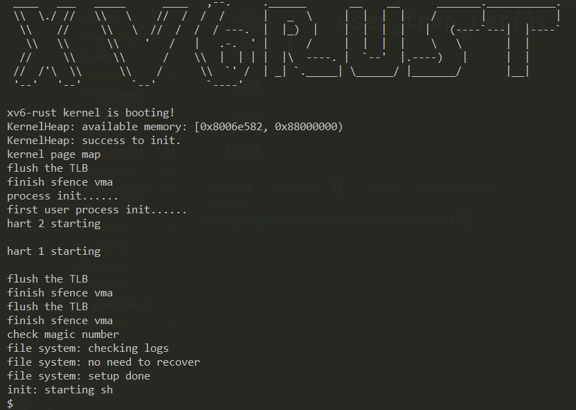

# xv6-rust

[](LICENSE)

An xv6-inspired teaching operating system written in Rust for 64-bit RISC-V.
It boots on QEMU's `virt` machine and explores how Rust ownership and shared
types can be applied to a small, multi-core kernel.



> [!IMPORTANT]
> xv6-rust is an experimental learning project, not a production operating
> system. Kernel interfaces and on-disk formats may change without notice.

## Highlights

- Multi-core RV64 kernel running on QEMU `virt`
- Virtual memory, traps, timer interrupts, and system calls
- Buddy-system kernel allocator
- xv6-style filesystem backed by a VirtIO block device
- UART console plus PCI/E1000 initialization
- Scheduler-managed system threads
- User threads with shared address spaces and process resources
- FIFO scheduler run queue backed by `VecDeque`
- Userspace `quit` command for cleanly leaving QEMU

## Quick start

### Prerequisites

Install the following tools and make sure they are available on `PATH`:

- Rust through [rustup](https://rustup.rs/)
- GNU Make, a host C compiler, Perl, and Python 3
- a RISC-V bare-metal C toolchain providing either
  `riscv64-unknown-elf-*` or `riscv64-elf-*`
- `qemu-system-riscv64`

The repository selects Rust nightly through `rust-toolchain.toml`. Install the
target and binary utilities once:

```sh
rustup toolchain install nightly
rustup target add --toolchain nightly riscv64gc-unknown-none-elf
rustup component add --toolchain nightly llvm-tools-preview
cargo install cargo-binutils
```

Clone all submodules, build the filesystem image and kernel, then start QEMU:

```sh
git clone --recurse-submodules https://github.com/Ko-oK-OS/xv6-rust.git
cd xv6-rust
make run
```

At the `xv6 Rust >>>` prompt, try `ls`, `cat README.md`, `threadtest`, or
`forktest`. Run `quit` to shut down the guest and exit QEMU.

If the repository was cloned without `--recurse-submodules`, initialize the
userspace, allocator, and filesystem-builder repositories with:

```sh
git submodule update --init --recursive
```

## Testing

The integration harness rebuilds the guest, copies `fs.img` to a temporary
directory, and exercises a user program in a fresh QEMU instance. For example:

```sh
python3 tests/qemu_user_program.py scheduler-queue
python3 tests/qemu_user_program.py user-threads
python3 tests/qemu_user_program.py stressfs
```

Available cases are listed by:

```sh
python3 tests/qemu_user_program.py --help
```

The `scheduler-queue` case deliberately fills, drains, and reuses process slots
within one boot. It protects the run-queue invariants across `fork`, user-thread
creation, `yield`, sleep, and wakeup.

## Architecture

Process objects live in a fixed-size table because kernel stacks, raw parent
pointers, CPU-local process references, and user-thread trapframe addresses all
depend on stable slot addresses. Scheduling does not scan that table: a locked
`VecDeque<usize>` stores runnable slot indices in FIFO order. A per-process
`queued` bit makes the state transition and queue membership one invariant and
prevents two harts from selecting the same saved context.

See [the scheduler design](docs/scheduler.md) for the state transitions and
lock-order rules.

| Path | Purpose |
| --- | --- |
| `kernel/` | Rust kernel and RISC-V platform code |
| `xv6-user/` | C userspace and syscall wrappers (submodule) |
| `allocator/` | Buddy allocator (submodule) |
| `xv6-mkfs/` | Host-side filesystem image builder (submodule) |
| `tests/` | QEMU-driven regression programs and harness |
| `docs/` | Design notes and project documentation |

## Development

Useful commands from the repository root:

```sh
make -C kernel build   # build the kernel binary
make fs.img            # build userspace and the filesystem image
make run               # build and boot a three-hart QEMU guest
make asm               # write the kernel disassembly to kernel.S
make clean              # remove generated build artifacts
```

`make -C kernel debug` starts QEMU and GDB in a tmux session. The GDB executable
is currently configured by `GDB` in `kernel/Makefile`; override that variable
for your local RISC-V toolchain when necessary.

## Project status and roadmap

The core educational path—boot, memory management, processes, system calls,
locking, filesystem access, multi-core scheduling, system threads, and user
threads—is implemented. Current areas for further work include:

- completing the E1000 data path and adding a network stack
- documenting and simplifying the kernel memory model
- expanding scheduler policy and observability
- adding asynchronous I/O
- supporting more boards and architectures

Open bugs and proposed work are tracked in
[GitHub Issues](https://github.com/Ko-oK-OS/xv6-rust/issues).

## Contributing

Issues, documentation fixes, tests, and focused pull requests are welcome.

1. Open or select an issue so the expected behavior is clear.
2. Create a descriptive branch such as `feature/fifo-scheduler` or
   `fix-bugs/exec-cleanup`.
3. Keep commits focused and explain non-obvious kernel invariants in code.
4. Run the relevant QEMU regression cases and include the results in the PR.
5. Describe user-visible behavior, design tradeoffs, and follow-up work.

For substantial architecture changes, please start with an issue or discussion
before investing in an implementation.

## Documentation

- [Project design document (中文)](docs/项目设计文档.md)
- [Boot sequence](docs/boot.md)
- [Virtual memory](docs/vm.md)
- [Process model](docs/process.md)
- [Scheduler](docs/scheduler.md)
- [Locks](docs/lock.md)
- [Interrupts](docs/interrupt.md)
- [Filesystem (中文)](docs/xv6%20文件系统.md)

## Acknowledgements

This project builds on ideas and teaching material from
[xv6-riscv](https://github.com/mit-pdos/xv6-riscv),
[rCore](https://github.com/rcore-os/rCore), and
[Writing an OS in Rust](https://os.phil-opp.com/).

## License

xv6-rust is available under the [MIT License](LICENSE).
