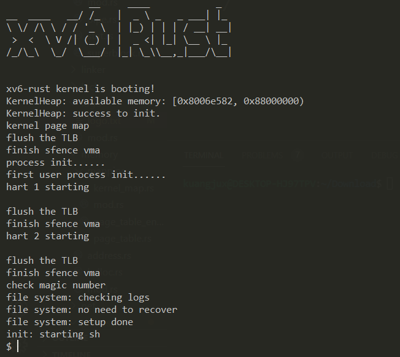

# xv6-rust
## Introduction



This is a try to implement xv6 OS in pure Rust. 

What's more, we are desired to add something new features into our OS, like network and GUI.  

The further goal of this project is to support multiple architecture and multiple boards, finally making our OS running in our own CPU.   

For the purpose of supporting the feature of Rust language, I also intend to use `async/await` feature to implement kernel thread scheduler renewedly.  

Due to the complexity of the project and the busy course-work, I think it's hard to complete above work independently, so I'm sincerely hope others can interest on this project and join our teams.

## Start  
### QEMU
**Linux**:  
```
wget https://download.qemu.org/qemu-5.0.0.tar.x  
tar xvJf qemu-5.0.0.tar.xz  
cd qemu-5.0.0  
./configure --target-list=riscv32-softmmu,riscv64-softmmu   
make -j$(nproc)  
sudo make install  
```
If you find some errors when building, you can slove by following hints:  
- `ERROR: pkg-config binary 'pkg-config' not found` : `sudo apt-get install pkg-config`           
- `ERROR: glib-2.48 gthread-2.0 is required to compile QEMU`: `sudo apt-get install libglib2.0-dev`       
- `ERROR: pixman >= 0.21.8 not present`: `sudo apt-get install libpixman-1-dev` 

### Rust
You need download rust to start our environment. We suggest you to use official shell:  
```
curl https://sh.rustup.rs -sSf | sh
```
If you fail because of slow network speed. You can try this to speed up:   
```
export RUSTUP_DIST_SERVER=https://mirrors.ustc.edu.cn/rust-static
export RUSTUP_UPDATE_ROOT=https://mirrors.ustc.edu.cn/rust-static/rustup
curl https://sh.rustup.rs -sSf | sh
```

If you have finished these, you can test your environment by following commands:  
```
source $HOME/.cargo/env  
rustc --version
```
In addition,  we'd better change the package mirror address crates.io used by the package manager cargo to the mirror server of the University of Science and Technology of China to speed up the download of the tripartite library. We open (create a new file if it doesn't exist) ~/.cargo/config and modify the content to:  
```
[source.crates-io]
registry = "https://github.com/rust-lang/crates.io-index"
replace-with = 'ustc'
[source.ustc]
registry = "git://mirrors.ustc.edu.cn/crates.io-index"
```
Besides,  you also update some tools in rust:

```
rustup target add riscv64gc-unknown-none-elf
cargo install cargo-binutils
rustup component add llvm-tools-preview
```

Finally, you run this OS on your machine by excuteing following commands:  

```
git clone https://github.com/Ko-oK-OS/xv6-rust.git
cd xv6-rust
git submodule update --init --recursive
make run
```

## GDB Usage
To use gdb to debug, we need to download `riscv64-unkonown-elf-gdb` and `tmux`.

### GDB Download
- [Ubuntu](https://static.dev.sifive.com/dev-tools/riscv64-unknown-elf-gcc-8.3.0-2020.04.1-x86_64-linux-ubuntu14.tar.gz)
- [CentOS](https://static.dev.sifive.com/dev-tools/riscv64-unknown-elf-gcc-8.3.0-2020.04.1-x86_64-linux-centos6.tar.gz)
- [macOS](https://static.dev.sifive.com/dev-tools/riscv64-unknown-elf-gcc-8.3.0-2020.04.1-x86_64-apple-darwin.tar.gz)
- [Windows](https://static.dev.sifive.com/dev-tools/riscv64-unknown-elf-gcc-8.3.0-2020.04.1-x86_64-w64-mingw32.zip)

We support gdb in OS kernel, you can exectue this command in `xv6-rust/kernel` directory:   
```shell
make debug
```
And then you can debug this programe step by step. 

## Schedule

- Virtual Memory and Management   
    - [x] Virtulal Memory Map
    - [x] Kernel Allocator(Buddy System Allocator)  
    - [x] Load ELF Files From Memory
- Traps,Interrupts, and drivers
    - [x] Kernel Trap
    - [x] Users Trap
    - [x] UART Drivers
    - [x] Machine-Mode Timer Interrupt
    - [x] Virtio Disk Drivers
    - [x] PCI and E1000 Drivers
- Locking
    - [x] Spinlock
    - [x] Sleeplock
- Process and Scheduing
    - [x] Process
    - [x] Scheduing
    - [x] Muti-Core Support
    - [x] Syscall
- File System
    - [x] Mkfs
    - [x] Buffer Layer
    - [x] Log Layer
    - [x] SuperBlock Layer
    - [x] Inode Layer
    - [x] Bitmap Layer
    - [x] File Descriptor Layer
    - [x] File Path
    - [x] Pipe 
    - [x] Syscall
- NetWork
    - [x] PCI and E1000 Initialize
    - [x] Protocol Headers
    - [ ] Network Card Driver
    - [ ] Syscall
- Device Driver
    - [x] Virtio Disk
    - [x] Uart/Console
    - [x] PCI

## Differences
### Fs
- [x] Remove `FILE_TABLE`
- [x] Use `Arc` instead of `refs`, `Arc::clone()` will plat the same role of `refs++`
- [ ] User `enum FileInner` to separate files of various file types

### Scheduler
- [ ] Use `VecDeque` instead of raw array.

### Process
- [ ] Use `BTreeMap` to maintain open files in `Process`
- [ ] Add `Thread` in Kernel Process

## Expected Future
- [ ] More Clear Memory Model
- [ ] Better Scheduler
- [ ] SD Card Driver Support
- [ ] Network Support(Use `smoltcp` to simplify design)
- [ ] Async IO Support

## Docs

[项目设计文档](docs/项目设计文档.pdf)

## References

- [Building a stupid Mutex in the Rust](https://medium.com/@Mnwa/building-a-stupid-mutex-in-the-rust-d55886538889)  
- [Rust源码分析：std::sync::Mutex](https://zhuanlan.zhihu.com/p/50006335)   
- [buddy_system_allocator](https://github.com/rcore-os/buddy_system_allocator)  
- [Write a OS in Rust](https://os.phil-opp.com)  
- [rCore-Tutorial-v3](https://rcore-os.github.io/rCore-Tutorial-Book-v3/index.html)
- [rCore-Tutorial](https://rcore-os.github.io/rCore-Tutorial-deploy/)  
- [xv6-riscv](https://github.com/mit-pdos/xv6-riscv)
- [xv6-riscv-rust](https://github.com/Jaic1/xv6-riscv-rust)
- [rCore](https://github.com/rcore-os/rCore)

## License
MIT License
