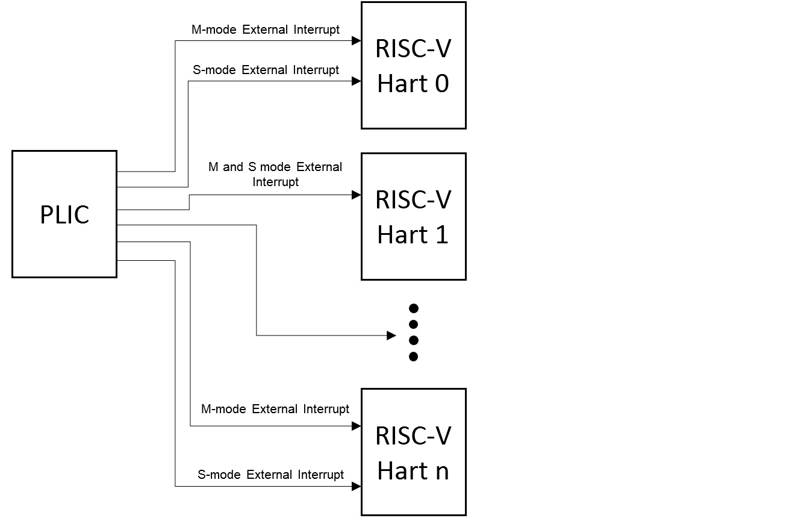
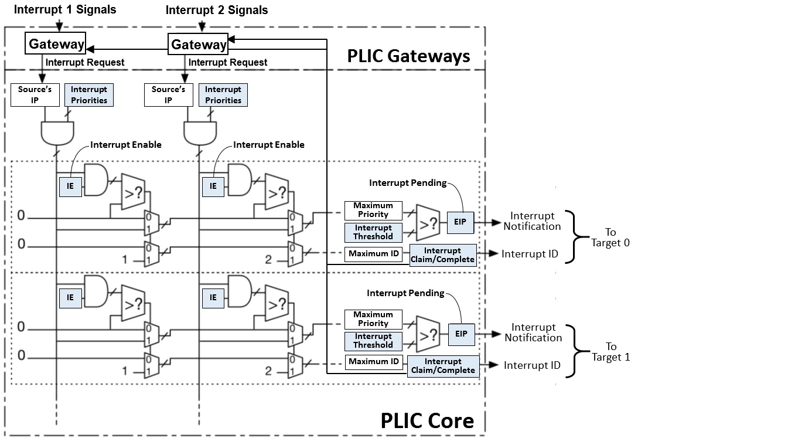

# 中断
## 内核中断机制
### 中断代理
```Rust
// delegate all interrupts and exceptions to supervisor mode.
    medeleg::write(0xffff);
    mideleg::write(0xffff);
    sie::write(sie::read() | sie::SIE::SEIE as usize | sie::SIE::STIE as usize | sie::SIE::SSIE as usize);
```  
首先，我们在bootloader阶段进行中断代理，此时，我们仍处在M特权级，而我们的内核需要运行在S特权级。默认情况下，所有的陷阱中断都会在M态进行处理，因此我们需要将其代理到S态以便我们进行处理。    
   

这里首先简要介绍一下`medeleg`(machine exception delegation register),`mideleg`(machine interrupt delegation register)以及`sie`（supervisor interrupt register）寄存器的作用：  
  

`medeleg`和`mideleg`表明表明当前的中断或者异常应当处理在更低的特权级。在系统中我们拥有3个特权级（M/S/U），通过设置`medeleg`和`mideleg`可以将发生在系统的中断代理到S态进行处理。如果支持U态的话，我们也可以通过设置`sedeleg`和`sideleg`寄存器来将中断代理到U态进行处理。 


而`sie`则是中断使能寄存器的意思，0-15位被分配为标准中断原因，16位以上则为特定的平台或者客户端所设置。  
在这里我们需要设置`sie`寄存器为可写的并且设置其`SEIE`、`STIE`以及`SSIE`位。    
   

其中，`SEIE`设置表明开启S态外部中断；`STIE`表示开启S态时钟中断；`SSIE`设置表明开启S态软件中断。
 
### 开启中断
首先我们在`trapinit`函数里面将`kernelvec`作为地址写入`stvec`寄存器中，`stvec`寄存器为`Supervisor Trap Vector Base Address Register `，包括向量基地址以及向量模式。如此一来，当我们的操作系统内核检测到发生中断后，就去`stvec`去查看处理陷阱函数的地址，随后进入其中进行陷阱处理。  
   
其中，我们的陷阱处理函数由一段汇编表示:
```asm
.section .text
.global kertrap
.globl kernelvec
.align 4
kernelvec:
        // make room to save registers.
        addi sp, sp, -256

        // save the registers.
        sd ra, 0(sp)
        sd sp, 8(sp)
        sd gp, 16(sp)
        sd tp, 24(sp)
        sd t0, 32(sp)
        sd t1, 40(sp)
        sd t2, 48(sp)
        sd s0, 56(sp)
        sd s1, 64(sp)
        sd a0, 72(sp)
        sd a1, 80(sp)
        sd a2, 88(sp)
        sd a3, 96(sp)
        sd a4, 104(sp)
        sd a5, 112(sp)
        sd a6, 120(sp)
        sd a7, 128(sp)
        sd s2, 136(sp)
        sd s3, 144(sp)
        sd s4, 152(sp)
        sd s5, 160(sp)
        sd s6, 168(sp)
        sd s7, 176(sp)
        sd s8, 184(sp)
        sd s9, 192(sp)
        sd s10, 200(sp)
        sd s11, 208(sp)
        sd t3, 216(sp)
        sd t4, 224(sp)
        sd t5, 232(sp)
        sd t6, 240(sp)

	// call the C trap handler in trap.rs
        call kerneltrap

        // restore registers.
        ld ra, 0(sp)
        ld sp, 8(sp)
        ld gp, 16(sp)
        // not this, in case we moved CPUs: ld tp, 24(sp)
        ld t0, 32(sp)
        ld t1, 40(sp)
        ld t2, 48(sp)
        ld s0, 56(sp)
        ld s1, 64(sp)
        ld a0, 72(sp)
        ld a1, 80(sp)
        ld a2, 88(sp)
        ld a3, 96(sp)
        ld a4, 104(sp)
        ld a5, 112(sp)
        ld a6, 120(sp)
        ld a7, 128(sp)
        ld s2, 136(sp)
        ld s3, 144(sp)
        ld s4, 152(sp)
        ld s5, 160(sp)
        ld s6, 168(sp)
        ld s7, 176(sp)
        ld s8, 184(sp)
        ld s9, 192(sp)
        ld s10, 200(sp)
        ld s11, 208(sp)
        ld t3, 216(sp)
        ld t4, 224(sp)
        ld t5, 232(sp)
        ld t6, 240(sp)

        addi sp, sp, 256

        // return to whatever we were doing in the kernel.
        sret
```
  
可以看到，我们将必要的寄存器值保存进栈里，然后调用`kerneltrap`这个函数进行内核陷阱的处理，当我们执行完`kerneltrap`函数返回后，我们将栈内容恢复，并将保存的上下文内容恢复，随后执行`sret`指令返回发生陷阱的指令后继续进行运行。  

### 开启PLIC
`PLIC`为`the riscv Platform Level Interrupt Controller`，其作用如下图所示:
  

可以看到`PLIC`接收到中断后将其转发给不同的`Hart`来使其处理。
  
`PLIC`结构如上图所示, 当`PLIC`接收到中断信号后，在内部进行逻辑的信号处理，最后输出信号给对应的CPU进行处理。  
  
而在`QEMU`平台下，我们不需要去接入具体的外部设备，只需要向`QEMU`提供的测试地址内写入一些值，即可开启外部中断的检测。  
  
例如在`xv6-rust`中的`plicinit`函数：
```Rust
pub unsafe fn plicinit(){
    println!("plic init......");
    // set desired IRQ priorities non-zero (otherwise disabled).
    let plic:usize = Into::<usize>::into(memlayout::PLIC);
    let mut addr = plic + memlayout::UART0_IRQ*4;
    ptr::write_volatile(addr as *mut u32, 1);

    addr  = plic + memlayout::UART0_IRQ*4;
    ptr::write_volatile(addr as *mut u32, 1);
}
```  
  
我们只需要将对应的外设的值按规定写入对应的物理地址中，即可开启外设的外部中断机制。  
   
### 内核中断处理  
当我们进入内核中断处理函数（即`kerneltrap`）后，我们需要通过`scause`寄存器的值来获取发生中断或异常的原因，从而根据不同的原因进行处理。而与此同时，我们也需要获取去读取`sstatus`和`sepc`寄存器来进行中断间的上下文切换。  
  
其中，`sepc`寄存器记录了中断或者异常发生的虚拟地址，当我们的中断结束之后，RISC-V会将`sepc`寄存器的值写入程序计数器以便继续执行，因此我们需要将`sepc`的值进行修改并重新写入`sepc`以保存上下文。  
  
同样，`sstatus`寄存器保存的是当前发生中断或者异常所在特权级，当中断或异常发生在U态的时候，`sstatus`的`SPP`位被置为0，然后`sret`指令后将返回U态；当`sstatus`的`SPP`位被置为1时，`sret`指令将返回S态，这时`SPP`位仍然被置为0。  
  
```Rust
// interrupts and exceptions from kernel code go here via kernelvec,
// on whatever the current kernel stack is.
#[no_mangle]
pub unsafe fn kerneltrap(
   arg0: usize, arg1: usize, arg2: usize, _: usize,
   _: usize, _: usize, _: usize, which: usize
) {

    let mut sepc = sepc::read();
    let sstatus = sstatus::read();
    let scause = scause::read();

    // if !sstatus::is_from_supervisor() {
    //     panic!("kerneltrap: not from supervisor mode");
    // }

    if sstatus::intr_get() {
        panic!("kerneltrap(): interrupts enabled");
    }
    
    let which_dev = devintr();

    match which_dev {
        0 => {
            // modify sepc to countine running after restoring context
            sepc += 2;
            
            let scause = Scause::new(scause);
            match scause.cause(){
                Trap::Exception(Exception::Breakpoint) => println!("BreakPoint!"),

                Trap::Exception(Exception::LoadFault) => panic!("Load Fault!"),

                Trap::Exception(Exception::LoadPageFault) => panic!("Load Page Fault!"),

                Trap::Exception(Exception::StorePageFault) => panic!("Store Page Fault!"),

                Trap::Exception(Exception::KernelEnvCall) => kernel_syscall(arg0, arg1, arg2, which),

                _ => panic!("Unresolved Trap! scause:{:?}", scause.cause())
            }

        }

        1 => {
            panic!("Unsolved solution!");
            

        }

        2 => {
            CPU_MANAGER.yield_proc();
        }

        _ => {
            unreachable!();
        }
    }

    // store context
    sepc::write(sepc);
    sstatus::write(sstatus);
}
```
其中,`devintr`函数则检测其是否为外部中断，时钟中断以及其它中断或异常。