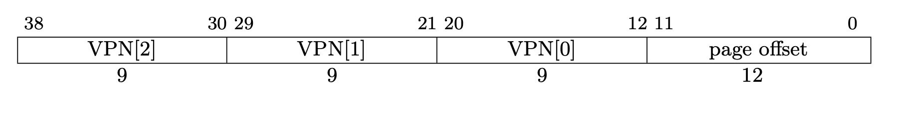
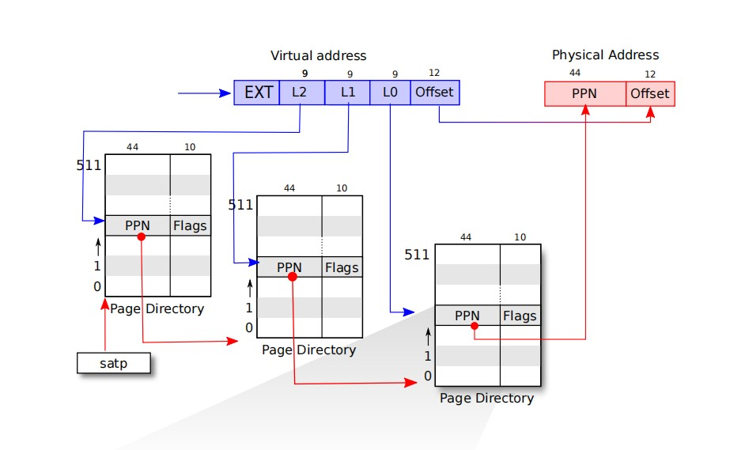

# 虚拟内存
## 分页硬件
在我们介绍我们的虚拟内存映射实现之前，我们首先介绍一下RISC-V关于分页的硬件标准。  

我们的OS运行在Sv39 RISC-V上面，对于运行在64位的虚拟地址仅仅使用其低39位，高25位是未被使用的；虚拟地址使用低39位中的高27位去索引页表去找到页表项（`PTE`: Page Table Entry）。其中每个页表项包含一个44位的物理页号（`PPN`）和一些标志位。  

当OS通过`PTE`找到`PPN`后，根据其`PPN`去寻找其物理页号，随后根据2级索引再去找到对应的`PTE`提取其`PPN`。在经过三级索引后，我们发现最终的物理页号并将其与我们虚拟地址的低12位偏移量（offset）拼接起来成为真正的物理地址。

每个页表使用4096字节来描述，其中包含512个页表项；每个页表项都包含下级物理页号的物理地址。其中顶部页表作为物理地址存在寄存器中以便进行虚实地址转换时查询。

待开发......