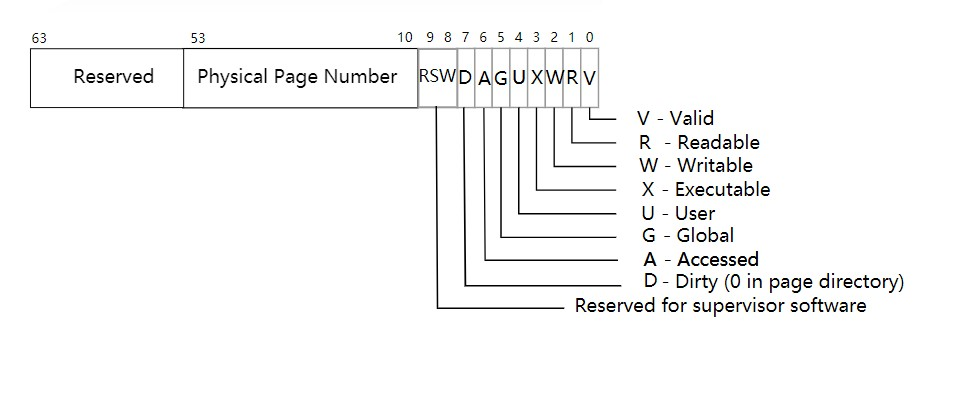

# 虚拟内存
## 分页硬件

在我们介绍我们的虚拟内存映射实现之前，我们首先介绍一下RISC-V关于分页的硬件标准。  

我们的OS运行在Sv39 RISC-V上面，对于运行在64位的虚拟地址仅仅使用其低39位，高25位是未被使用的；虚拟地址使用低39位中的高27位去索引页表去找到页表项（`PTE`: Page Table Entry）。其中每个页表项包含一个44位的物理页号（`PPN`）和一些标志位。  

当OS通过`PTE`找到`PPN`后，根据其`PPN`去寻找其物理页号，随后根据2级索引再去找到对应的`PTE`提取其`PPN`。在经过三级索引后，我们发现最终的物理页号并将其与我们虚拟地址的低12位偏移量（offset）拼接起来成为真正的物理地址。

每个页表使用4096字节来描述，其中包含512个页表项；每个页表项都包含下级物理页号的物理地址。其中顶部页表作为物理地址存在寄存器中以便进行虚实地址转换时查询。

为了告诉硬件使用页表映射机制，内核必须将根页表页的物理地址写入`satp`寄存器。每个CPU都有自己的`satp` 。CPU将使用其自己的`satp`指向的页表来转换后续指令生成的所有地址。由于每个CPU都有自己的`satp`，因而不同的CPU可以运行不同的进程，每个进程都有一个由其自己的页表描述的专用地址空间。

物理内存是指DRAM中的存储单元。物理内存中每一个字节都有一个地址（通常情况下按字节编址），称为物理地址。指令仅使用虚拟地址，分页硬件负责将其转换为物理地址，然后将其发送至DRAM硬件以读取或写入额你存。与物理内存和虚拟地址不同，虚拟内存不是物理对象，而是内核提供的抽象和机制的集合，用于管理物理内存和虚拟地址。

## 内核地址空间

`xv6-rust`为每个进程维护一个页表，用于描述每个进程的用户地址空间。除此之外，还有单独一个页表用于描述内核的地址空间。内核配置其地址空间的布局，以使其能够以可预测的虚拟地址访问物理内存和各种硬件资源。

如上图所示为`xv6-rust`的地址内存空间分布。

QEMU可以模拟一个包含RAM（物理内存）的机器，该RAM从物理地址0x80000000开始，一直延伸到至少0x86400000，我们将其称为PHYSTOP。QEMU模拟还包括I/O设备，例如磁盘接口。QEMU以物理地址空间中0x80000000以下的内存映射控制寄存器的形式为软件提供设备接口。内核可以通过读/写这些特殊的物理地址与设备进行交互；这样的读写实际上是在与设备硬件进行通信，而不是RAM。

内核使用“直接映射”来获取RAM和内存映射的设备寄存器。也就是说，将资源映射到与物理地址相等的虚拟地址。例如，内核本身在虚拟地址空间和物理内存中都位于KERNBASE = 0x80000000 。直接映射简化了读取或写入物理内存的内核代码。例如，当fork为子进程分配用户内存时，分配器返回该内存的物理地址；fork将父进程的用户内存复制到子进程时，fork直接将该地址用作虚拟地址。

有几个内核虚拟地址不是直接映射的：

- trampoline页面。它映射在虚拟地址空间的顶部。用户页表具有与此相同的映射。注意到，一个物理页面（包括trampoline代码）在内核的虚拟地址空间中映射了两次：一次在虚拟地址空间的顶部，一次是直接映射。
- 内核堆栈页面。每个进程都有自己的内核堆栈，该堆栈被映射到较高的位置，因此`xv6-rust`在其下方可以留下未映射的保护页。保护页的`PteFlags`无效（即，`PteFlags::V`置0），因此，如果内核溢出内核堆栈，则很可能会导致异常，并且内核会出现紧急情况。如果没有保护页，溢出的堆栈将覆盖其他内核内存，从而导致错误的操作，系统很可能会崩溃。

内核通过高内存映射使用其堆栈时，内核也可以通过直接映射的地址访问它们。替代设计可能只具有直接映射，并在直接映射的地址处使用堆栈。然而，在这种安排下，提供保护页将涉及取消映射虚拟地址，否则这些虚拟地址将引用物理内存，因此将很难使用。

内核通过置标志位`PteFlags::R`（可读）和`PteFlags::X`（可执行）映射trampoline的页面和内核文本。内核从这些页面读取并执行指令。内核通过置标志位`PteFlags::R`（可读）和`PteFlags::W`（可写）映射其他页面，以便它可以在那些页面中读取和写入内存。保护页面的映射无效。