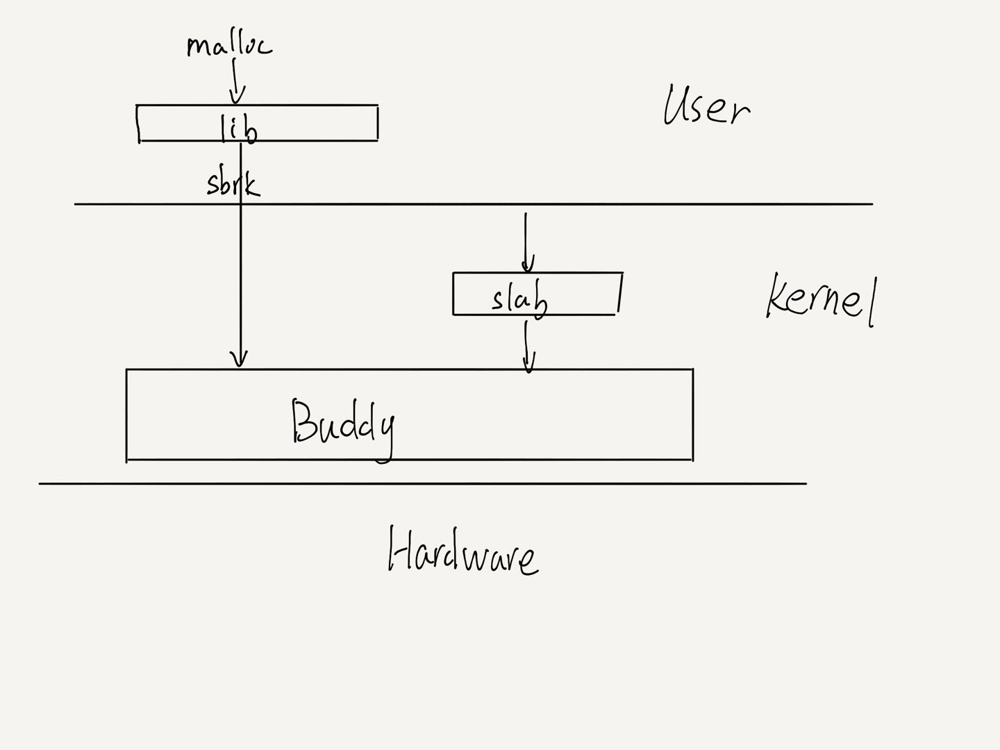

<h1>
    <center>xv6-rust设计报告</center>
</h1>

<h3><center>2021全国大学生计算机系统能力大赛操作系统设计赛</center></h3>

<h3><center>Ko-oK</center></h3>

<h4><center>齐呈祥(队长)、 闫璟、    李丰杰</center></h4>


### 一、设计简介

本项目为使用Rust语言对MIT的`xv6-riscv`项目的重新设计与实现，这次实验既可以看做Rust语言在操作系统开发的探索，也可用作高校在操作系统这门课程上的实践作业。

### 二、 设计思路

Rust作为更具现代化的语言，相对于传统的系统开发语言C语言来说具有更强的抽象性，这使得Rust语言具有更强的表意性。同时，Rust为了保证开发的安全性，它强制用户使用所有权机制来保证系统的安全性，对于未实现`Copy`特性的类型，则赋值操作均按照移动语意来处理。同时，Rust设置不可变引用与可变引用，Rust的引用是对裸指针的封装，在编译期会进行一些检查：例如，在一个作用域内可以同时出现多个不可变引用但只能出现一个可变引用，且不可变引用与可变引用不能在同一作用域内出现。同时，Rust对于直接操作裸指针视作是`unsafe`的，如果我们想去直接读写裸指针，则必须将代码块标识为`unsafe`。Rust的这些特性可以将大部分使用传统系统语言难以察觉的错误拦截在编译期，极大地方便了我们的调试过程。但这些也使得我们充分利用Rust特性对OS进行重新开发。以下我将挑选几点使用Rust的特性对`xv6-riscv`进行重新实现的部分进行详细说明。

**1. 锁的实现**

在`xv6-riscv`中，对于需要锁的结构，仅仅在其中的域里放入锁结构的指针。而在获取锁的过程中，仅仅对于变量的`lock field`进行检查从而判断其是否可以acquire。这种写法对于程序员有极高的要求，因为他在不获取锁的情况下依然可以变量的内容，或者由于程序员忘记了去release锁都将会造成程序死锁且难以调试。

Rust具有较为完善的类型系统，支持泛型。因此我们可以将锁设计为智能指针的形式，将变量具体内容包裹在锁内部，当我们调用`acquire`方法的时候返回一个守卫变量，在变量中可以访问原数据的各个域。除此之外，Rust有`Drop`特性，只要我们为我们的锁实现了`Drop`特性，当变量离开作用域时会自动release锁变量，真正意义上实现了`RAII`，从而避免死锁。

例如，在`xv6-riscv`中，它使用如下结构来上锁：

```c
struct {
  struct spinlock lock;
  struct run *freelist;
} kmem;
```

而我们使用将lock作为指针包裹在变量外面的方式进行上锁:

```rust
pub struct KernelHeap(Spinlock<BuddySystem>);
```

- 自旋锁

在自旋锁的实现上，我们调用 `acquire` 方法并返回一个`SpinlockGuard`类型的变量，并为`SpinlockGuard`实现了 `Drop` 和 `DeferMut` 特性，从而使其更不容易发生死锁。

其中，`acquire` 使用 CAS(Compare And Swap) 来实现，自旋锁通过原子变量的内存排序来判断是否可以上锁，倘若不可以则保持忙等待状态。可以注意到，在上锁与解锁的中间，伴随 `push_off` 和 `pop_off` 的操作，这是对 `intr_on` 和 `intr_off` 的封装，这是防止在上锁的时候发生了外部中断而造成死锁。

```rust
    pub fn acquire(&self) -> SpinlockGuard<'_, T> {

        push_off();
        if self.holding() {
            panic!("acquire");
        }
        
        while self.locked.swap(true, Ordering::Acquire){
            // Now we signals the processor that it is inside a busy-wait spin-loop 
            spin_loop();
        }
        fence(Ordering::SeqCst);
        unsafe {
            self.cpu_id.set(cpuid() as isize);
        }

        SpinlockGuard{spinlock: &self}
    }

    pub fn release(&self) {
        if !self.holding() {
            panic!("release");
        }
        self.cpu_id.set(-1);
        fence(Ordering::SeqCst);
        self.locked.store(false, Ordering::Release);

        pop_off();
    }
```

我们为自旋锁实现了 `Drop` 和 `DerefMut` 特性，方便可以通过 `SpinlockGuard` 来修改包裹值和当销毁 `SpinlockGuard` 时自动解锁。

```rust
impl<T> Deref for SpinlockGuard<'_, T>{
    type Target = T;

    fn deref(&self) -> &Self::Target {
        unsafe{
            &*self.spinlock.data.get()
        }
    }
}   

impl<T> DerefMut for SpinlockGuard<'_, T>{
    fn deref_mut(&mut self) -> &mut Self::Target{
        unsafe{
            &mut *self.spinlock.data.get()
        }
    }
}

impl<T> Drop for SpinlockGuard<'_, T>{
    fn drop(&mut self){
        self.spinlock.release()
    }
}

```

**睡眠锁**

睡眠锁同自旋锁不同，自旋锁通过 CAS （Compare And Swap）来实现，而睡眠锁则除了使用自旋锁来保护睡眠锁之外，同时需要调用当前进程的 `sleep` 使其休眠并进入调度器进行调度，当调用之后则释放自旋锁。使用自旋锁来保护的原因是我们可以确保我们将不会错过任何一次 `wake_up` 来唤醒被休眠的进程。当睡眠锁解锁的时候，也需要去获取自旋锁并调用 `wake_up` 方法来唤醒被休眠的进程，之后释放自旋锁。

**2. 静态变量**

在Rust中，静态变量在编译之后就拥有了精确的内存地址，这就意味着不能在运行时为静态变量进行地址空间的分配。同样一件事，在C语言中可以将其作为全局变量声明，之后在程序运行时再对其进行初始化，然而这在Rust语言中是不允许的。因此我们对于特定类型的变量都要为其提供`new()`方法进行初始化；对于需要在堆上分配的变量，需要使用`lazy_static!`宏对其进行懒加载从而实现动态内存分配。

以`xv6-rust`中的程序来举例，我们需要在操作系统启动过程中为内核分配页表从而通过页表项记录物理地址到虚拟地址的转换：

```rust
pub static mut KERNEL_PAGETABLE:PageTable = PageTable::empty();
```

```rust
impl PageTable{
    pub const fn empty() -> Self{
        Self{
            entries:[PageTableEntry(0); PGSIZE/8]
        }
    }
}
```

同时，在`e1000`网卡驱动程序中，根据Intel的标准，我们需要为发送消息与接收消息分配消息缓冲队列，并将队列的头地址写入寄存器中，当我们实现发送消息或者接收消息时，则网卡会从这些队列中根据其他寄存器的信息来发送和接收分组。因此我们使用`lazy_static`来为我们的全局变量来分配空间：

```rust
lazy_static! {
    static ref RECEIVE_MBUF:Spinlock<[MBuf;RECEIVE_RING_SIZE]> = Spinlock::new(array![_ => MBuf::new();RECEIVE_RING_SIZE], "receive_mbuf");
    static ref TRANSMIT_MBUF:Spinlock<[MBuf;TRANSMIT_RING_SIZE]> = Spinlock::new(array![_ => MBuf::new();TRANSMIT_RING_SIZE], "transmit_mbuf");
}
```

对静态变量做写操作是不安全的，因此我们使用锁来包裹变量内容，从而简化我们的程序。

**3. 所有权机制与RAII**

所有权机制很好，但对于程序员来说却是一种折磨，在实现`xv6-rust`的过程中遇到了许多由所有权机制带来的问题，尤其是在写调度算法的时候。举例来说，在实现`alloc_proc()`函数时（即为进程分配一块地址空间）：

```rust
pub fn alloc_proc(&mut self) -> Option<&mut Process> {
        for p in self.proc.iter_mut() {
            let mut guard = p.data.acquire();
            if guard.state == Procstate::UNUSED {
                .
                .
                .
                // An empty user page table
                if let Some(page_table) = unsafe { extern_data.proc_pagetable() } {
                    .
                    .
					.
                } else {
                    p.freeproc();
                    drop(guard);
                    return None
                }
            }else {
                p.freeproc();
                drop(guard);
            }
        }
    	None
    }
```

可以看到，在最初的实现中，我们首先遍历调度器内部所有的进程，然后找到一个状态为未使用的空进程，并为它分配页表，如果失败的话就释放它。但是由于此时在if与else连个代码块中同时持有了对于`p`的可变引用，这在rust的编译器中是不允许的，所以rust编译器不予通过，因此，我们只能通过修改`proc_pagetable()`函数使其在内部进行检查是否分配成功当失败时调用`freeproc()`释放页表的物理内存分配。修改后的代码如下：

```rust
pub fn alloc_proc(&mut self) -> Option<&mut Process> {
        for p in self.proc.iter_mut() {
            let mut guard = p.data.acquire();
            if guard.state == Procstate::UNUSED {
				.
                .
                .
                // An empty user page table
                unsafe{
                    extern_data.proc_pagetable();
                }
               	.
                .
				.
            }else {
                drop(guard);
            }
        }

        None
    }
```

此时我们在`proc_pagetable()`完成了检查的过程，只需在`alloc_proc()`调用其方法即可避免所有权的错误。

**4. 进程的设计**

在使用Rust重新实现`xv6-riscv`的过程中，在进程与调度的设计与实现中遇到了很大的麻烦。在C语言中尽管要求程序员具有很高的自律性，但其具有很高的灵活性来设计操作系统。例如在进程的实现时，一个进程的某些内容需要在线程访问时上锁，有些内容不需要上锁。例如进程的状态、通道(channel)、是否被杀死、退出状态、进程ID这些可读写变量需要上锁访问；而对于内核虚拟内存、进程内存大小、用户页表、中断帧、上下文这些变量则不需要加锁访问。在`xv6-riscv`中可以很容易的实现：

```c
// Per-process state
struct proc {
  struct spinlock lock;

  // p->lock must be held when using these:
  enum procstate state;        // Process state
  void *chan;                  // If non-zero, sleeping on chan
  int killed;                  // If non-zero, have been killed
  int xstate;                  // Exit status to be returned to parent's wait
  int pid;                     // Process ID

  // proc_tree_lock must be held when using this:
  struct proc *parent;         // Parent process

  // these are private to the process, so p->lock need not be held.
  uint64 kstack;               // Virtual address of kernel stack
  uint64 sz;                   // Size of process memory (bytes)
  pagetable_t pagetable;       // User page table
  struct trapframe *trapframe; // data page for trampoline.S
  struct context context;      // swtch() here to run process
  struct file *ofile[NOFILE];  // Open files
  struct inode *cwd;           // Current directory
  char name[16];               // Process name (debugging)
};
```

在C中，只需要在进程的结构中放入一个锁的域，当需要访问需要上锁的变量时只需要调用锁的`acquire()`和`release()`方法来获取和释放锁来访问其中的域；当访问不需要上锁的内容时只需要直接访问其中的域即可。

而由于Rust的锁形式是以智能指针的方式包裹在变量的外层，因此如果我们直接像原有实现一样直接在变量外层包裹锁。那么无论我们想去访问公有域或者私有域都要将其`acquire()`和`release()`。那么试想一下，当我们去访问用户页表、打开文件、当前目录这些比较耗时的变量时将会使当前进程被锁住，这会导致效率极大的下降！

因此我们的实现是将公有域与私有域分开实现并将其放入`Process`结构中，并将公有域结构进行上锁，那么当我们需要访问公有域时只需将公有域部分上锁就可以了。

```rust
pub struct Process {
    pub data: Spinlock<ProcData>,
    pub extern_data: UnsafeCell<ProcExtern>,
}

pub struct ProcData {
    // p->lock must be held when using these
    pub state: ProcState,
    pub channel: usize, // If non-zero, sleeping on chan
    pub killed: bool, // If non-zero, have been killed
    pub xstate: usize, // Exit status to be returned to parent's wait
    pub pid: usize,   // Process ID
}

pub struct ProcExtern {
    // these are private to the process, so p->lock need to be held
    pub kstack:usize,  // Virtual address of kernel stack
    pub size:usize, // size of process memory
    pub pagetable: Option<Box<PageTable>>, // User page table
    pub trapframe: *mut Trapframe, // data page for trampoline.S
    pub context: Context, // swtch() here to run processs
    pub name: [u8; 16],   // Process name (debugging)
    // proc_tree_lock must be held when using this:
    pub parent: Option<*mut Process>,   
    pub ofile: Vec<Arc<RefCell<VFile>>>,
    pub cwd: Option<Inode>
}
```

**5. 中断的设计**

在原版 `xv6-riscv` 中，对于内核中断信息给出的信息较少，仅仅给出了`scause`、`sepc`、`sscause`等寄存器的值，具体的中断类型还需要去查看RISC-V来确定。因此我们参考 `rust-embedded/riscv` 的实现为我们寄存器做了优化。

在我们的中断的实现中，主要根据 `scause` 寄存器中读出的值进行了解析。其中，根据 `scause` 的最高位不同可以将其区分成异常和中断两种类型，而根据其低位又可以将其区分不同的异常和中断类型。

而在我们的中断中，我们通过分析`scause`来判断不同的中断类型来进行特定的处理，具体见[中断文档](interrupt.md)。

**6. 文件系统的实现**

在 `xv6-riscv` 中，文件系统的实现分为 7 层，分别为：`File Descriptor Layer`、`Pathname Layer`、`Directory Layer`、`Inode Layer`、`Log Layer`、`Buffer Layer` 、`Disk Layer`。首先文件系统通过系统调用获取需要操作的文件信息（即文件描述符），当所要操作的文件描述符为设备时，则直接通过设备 ID 操作设备。当所要操作的文件为目录或者文件时，则需要获取对应的路径名并通过其文件路径名在磁盘上获取对应的 `inode`，随后去完成对应的操作。

- Inode 的设计（参考 xv6-riscv-rust）

    在 `xv6-riscv` 的设计中，`inode struct` 为 `inode`  在内存中的拷贝，只有获取其睡眠锁之后，我们才能够获得在磁盘上存储的inode的信息。

    根据我们之前设计的经验，我们应当为 `SleepLock<Inode>` 类型实现 `lock` 方法，这样理论上是可行的，但是却是很不方便的。例如，在抽象文件的设计中，我们需要存储为 `Option<Inode>` 的内容，而带上睡眠锁后处理起来也很不方便。除此之外，`inode` 的一些信息不需要上锁也可以读取，这样就涉及到分 `field` 来设计，因此设计成 `SleepLock<Inode>` 的做法是不明智的。

    在我们的设计中，把获取锁前和获取锁后的数据进行分别处理，获取锁前的数据称为元数据，获取锁后为真实存储在磁盘上的数据。其中，当元数据执行获取操作时，我们根据元数据的 id 获取全局 `InodeCache` 对应的缓存数据，根据缓存数据是否为脏数据来进行刷新，并返回已经被上锁的磁盘数据。同样地，当我们对 inode 进行解锁时，我们充分利用了 rust 的 `Drop` 特性，当 `InodeData` 的生命周期结束或者手动销毁时，`InodeCache` 会自动执行 `put` 方法检查 inode 是否应当被回收。

- Device 的设计

    在 `xv6-riscv` 的设计中，在设备表中的每个结构体中都有读与写两个方法。而在我的实现中则选择使用两个指针来代替，指针指向对应的设备的读与写方法，当调用时转换为对应的方法。

- 块缓冲区的设计

    在  `xv6-riscv` 中，块缓冲区的设计使用双向链表来实现，而在 rust 中，由于所有权的设计，双向链表的实现并不是很容易。因此，我们依然需要将不同的域分开来实现，这样可以尽可能避免所有权带来的编译问题。其中，`BCache` 分为 LRU 和 Buf 两个域，其中 Buf 则为缓冲区内存储的全部内容，而 LRU 则使用 LRU 替换算法来读取，其中 LRU 分别有 `prev` 和 `next` 两个指针，分别指向前后块设备的元数据指针。

    而 `Buf` 结构体则是对于缓冲区原始数据的包裹，这是缓冲区数据在更加底层的抽象，在此结果上的修改可以写回磁盘上的数据。在我们的实现中，缓冲区队列可以通过元数据（即设备号或者块号）来获取对应的块缓冲区内容，同时，在获取块缓冲区内容的时候涉及到为对应的缓冲区数据上睡眠锁（即磁盘上的内容在内存中的直接拷贝）。同时，在释放锁时需要修改 LRU 的对应顺序以及检查和写回到原始磁盘上。

**7. 内存系统的设计**

- 内存分配系统

    由于 rust 有 `alloc` 特性，提供了内存分配的 API。在提供了标准库的程序里都会有一个全局的内存分配器来进行内存分配，而在 `no_std` 的环境下，只要我们实现了 `alloc` 特性并提供了全局的内存分配器，我们就可以使用 `Box` 或者 `Vec` 等智能指针。而在我们的实现中，在**内核态**和**用户态**分别使用了不同的方法来实现。

    **内存分配系统架构：**

    

    **内核态**

    在内核态中，我们使用**伙伴内存分配系统**来实现。伙伴内存分配系统主要是为了减少内存的浪费，例如要分配一块大的内存，使用传统的链式内存分配只能寻找一块足够大的内存来分配，这时中间有很多小块的内存会被忽略，这时就会造成内存的浪费。

    在伙伴内存分配系统中，每次分配的内存字节数都必须是 2 的整数幂，范围大小可以自由设置。不同大小内存的空闲块分别管理。假如想去分配 512 bytes 大小的内存块，则向维护 512 bytes 的空闲链表中寻找对应的空闲块，若没有则向维护 1024 bytes 的空闲块中寻找一个空闲块分配 512 bytes，剩余 512 bytes 则加入到 512 bytes 空闲块链表中。

    其中，`Buddy System` 是以页为基准来分配的（即最少为 4096 bytes）。而对于每页中的内存则需要使用 `slab` 来分配。其中，我们需要为每一页维护一张位图，每页维护当前内存是被分配或者被分割成更小的块。

    在为给定的 Layout 分配内存时，首先需要将该 Layout 的 size 与2的整数幂进行对齐，然后遍历对应 size 链表，若发现空闲内存则返回对应的指针，否则则遍历更大 size 的链表进行寻找空闲块。

    当回收内存时，我们需要根据给定的 Layout 发现对应的地址和大小，根据其分配情况或者直接释放内存 push 到原来的内存链表中或者进行合并后再次 push。   

    ```rust
    pub struct BuddySystem {
        initialized: bool,
        base: usize,            // the starting addr managed by the buddy system
        actual_end: usize,      // the actual end addr managed by the buddy system
        nsizes: usize,          // the number of different sizes of blocks
        leaf_size: usize,
        max_alignment: usize,
        infos: MaybeUninit<*mut [BuddyInfo]>,
    }
    
    /// Buddy info for block of a certain size k, k is a power of 2 
    #[repr(C)]
    struct BuddyInfo {
        free: List,                         // record blocks of a certain size
        alloc: MaybeUninit<*mut [u8]>,      // tell if a block is allocated
        split: MaybeUninit<*mut [u8]>,      // tell if a block is split into smaller size
    }
    ```

    如上所示为我们的 `Buddy` 系统的数据结构设计，其中 `BuddySystem` 维护了一些元信息，例如可分配的起始地址、终止地址以及最小可分配的字节数等等。其中，`infos` 指向一个 `BuddyInfo` 类型的数组指针。而每个 `BuddyInfo` 则代表不同 `size` 的链表信息的维护。`free` 维护当前 `size` 可用的内存信息的链表，而 `alloc` 和 `split` 则使用位图的形式去维护以当前 `size` 为基准的分配与分割情况。

    ```rust
        /// Allocate a block of memory satisifying the layout.
        pub fn alloc(&mut self, layout: Layout) -> *mut u8 {
            if layout.size() == 0 {
                return ptr::null_mut();
            }
    
            // only guarantee the alignment not bigger than max_alignment
            if layout.align() > self.max_alignment {
                return ptr::null_mut();
            }
            // note: the size of a value is always a multiple of its alignment
            // now we only have to consider the size
            // because base and actual_end are already align to max_alignment
    
            // find the smallest block can contain the size
            let smalli = if layout.size() <= self.leaf_size {
                0 
            } else {
                (layout.size().next_power_of_two() / self.leaf_size).trailing_zeros() as usize
            };
            let mut sizei = smalli;
            while sizei < self.nsizes {
                let info = unsafe { self.get_info_mut(sizei) };
                if !info.free.is_empty() {
                    break;
                }
                sizei += 1;
            }
            if sizei >= self.nsizes {
                // no free memory
                return ptr::null_mut()
            }
    
            // pop a block at self.infos[sizei]
            let info = unsafe { self.get_info_mut(sizei) };
            let raw_addr = match unsafe { info.free.pop() } {
                Some(raw_addr) => raw_addr,
                None => return ptr::null_mut(),
            };
            let bi = self.blk_index(sizei, raw_addr);
            unsafe { self.get_info_mut(sizei).alloc_set(bi, true); }
    
            // split the block until it reach smallest block size
            while sizei > smalli {            
                // split two buddies at sizei
                let bi = self.blk_index(sizei, raw_addr);
                let info = unsafe { self.get_info_mut(sizei) };
                info.split_set(bi, true);
    
                // alloc one buddy at sizei-1
                let bs1 = self.blk_size(sizei-1);
                let bi1 = self.blk_index(sizei-1, raw_addr);
                let info1 = unsafe { self.get_info_mut(sizei-1) };
                info1.alloc_set(bi1, true);
    
                // free the other buddy at sizei-1
                let buddy_addr = raw_addr + bs1;
                unsafe { info1.free.push(buddy_addr); }
    
                sizei -= 1;
            }
    
            raw_addr as *mut u8
        }
    
    ```

    而在我们 `alloc` 方法的实现中，我们首先去从小到大遍历空闲链表，发现一块拥有足够内存的块，并将其从链表中 `pop` 出来，随后根据块指针的值获取对应的块索引号并更新 `alloc` 位图的分配情况。同时，若分配的块大小大于所有分配的内存大小，则递归地分割块大小直到分配的块大小。

    类似地，`dealloc` 则是反其道而行之，通过获得的 `layout` 递归地向上恢复被分配的内存：

    ```rust
        /// Deallocate the memory.
        /// SAFETY: The raw ptr passed-in should be the one handed out previously.
        pub fn dealloc(&mut self, ptr: *mut u8, layout: Layout) {
            // check ptr in range [self.base, self.actual_end)
            let mut raw_addr = ptr as usize;
            #[cfg(debug_assertions)]
            if raw_addr < self.base || raw_addr >= self.actual_end {
                panic!("allocator: dealloc ptr out of range");
            }
    
            // find the size of block pointed by ptr
            // and check with the layout
            let mut sizei = self.nsizes;
            for i in 0..self.max_size() {
                let bi = self.blk_index(i+1, raw_addr);
                let info = unsafe { self.get_info_mut(i+1) };
                if info.is_split_set(bi) {
                    sizei = i;
                    break;
                }
            }
            #[cfg(debug_assertions)]
            if sizei == self.nsizes {
                panic!("allocator: dealloc cannot recycle ptr");
            }
    
            // check layout
            #[cfg(debug_assertions)]
            if layout.size() > self.blk_size(sizei) {
                panic!("allocator: layout {:?} > blk size {}", layout, self.blk_size(sizei));
            }
    
            // free and coalesce
            while sizei < self.max_size() {
                let bi = self.blk_index(sizei, raw_addr);
                let buddyi = if bi % 2 == 0 { bi+1 } else { bi-1 };
                let info = unsafe { self.get_info_mut(sizei) };
                info.alloc_set(bi, false);
                
                // test if buddy is free
                if info.is_alloc_set(buddyi) {
                    break;
                }
                let buddy_addr = self.blk_addr(sizei, buddyi);
                unsafe { (buddy_addr as *mut List).as_mut().unwrap().remove(); }
                if buddyi % 2 == 0 {
                    raw_addr = buddy_addr;
                }
    
                // coalesce and continue
                sizei += 1;
                let spliti = self.blk_index(sizei, raw_addr);
                let info = unsafe { self.get_info_mut(sizei) };
                info.split_set(spliti, false);
            }
    
            let info = unsafe { self.get_info_mut(sizei) };
            unsafe { info.free.push(raw_addr); }
        }
    
    ```

    **以下为一张 `Buddy` 系统的简略手绘图：**

    

    **用户态**

    在用户态中，我们使用 `sys_sbrk` 系统调用为用户进程来分配内存，而 `sys_sbrk `则使用 `Buddy System` 来分配内存。因此在用户态我们只需要实现一个双向链表来管理每次系统调用分配的内存即可。每次系统调用分配内存后，我们都将在分配指针的头部记录当前分配的信息，并将可用的内存指针向后移 `size_of::<Frame>()` 大小，并将其加到所维护的链表的尾部。

    ```rust
    /// User memory allocator based on linked list.
    pub struct UserAllocator {
        base: UnsafeCell<Frame>
    }
    
    /// Frame record every memory allocation information,
    /// which will write in the header of allocate memory.
    #[repr(C)]
    #[derive(Clone, Copy)]
    pub struct Frame {
        addr: *mut u8,
        size: usize,
        next: Option<*mut Frame>,
        prev: Option<*mut Frame>
    }
    ```

    

    当用户程序需要分配内存时，我们将遍历链表发现一块足够大小的内存，若该块内存大小和所要分配的内存大小正好相等则将其从链表中 `pop` 出来。否则我们将对应的头部信息向后移所要分配的内存大小，修改头部信息，并返回内存指针。

    当用户程序释放内存时，我们根据 Layout 的信息获取其指针和大小。当改内存块仍然在链表中则移动头部指针位置修改头部信息。若该内存块已经被移出链表，我们可以根据对应的头部信息将其重新加到链表对应的位置中。

- 栈的改进

    由于在 `xv6-riscv` 中的内核栈的大小为 4KB（即1页）。但4KB的大小对于某些进程来说是不够的，因此我们统一将每个进程的栈大小设置为 16KB（即4页）。当我们为每个进程映射栈内存时，需要分配5页，其中4页用来进行栈内存的映射，而最后一页则不进行映射，对于内核进行保护，当进程爆栈后会由于访问被保护的页而被强行终止而不会造成安全漏洞。

### 三、实现描述

请见该目录下其他文档，除此之外，我们也在代码中提供了详细的注释。由于时间原因，文档内容有空缺或者未更新，请见谅！

- [环境搭建](env.md)
- [gdb调试](gdb.md)
- [启动](boot.md)
- [锁](lock.md)
- [中断](interrupt.md)
- [物理内存分配](alloc.md)
- [虚拟内存](vm.md)
- [进程与线程](process.md)
- [调度](scheduler.md)

### 四、遇到的问题及解决办法

**1.  内核栈**

由于在操作系统的引导启动阶段，我们只为每个核分配了4KB的内核栈大小：

```assembly
    # qemu -kernel starts at 0x1000. the instructions
    # there seem to be provided by qemu, as if it
    # were a ROM. the code at 0x1000 jumps to
    # 0x80000000, the _entry function here,
    # in machine mode. each CPU starts here.
    .section .text
    .globl _entry
_entry:
	# set up a stack for Rust.
    # stack0 is declared below,
    # with a 16KB stack per CPU.
    # sp = stack0 + (hartid * 16384)
    # PS: 16KB stack for few stack bump
    la sp, stack0
    li a0, 16384
	csrr a1, mhartid
    addi a1, a1, 1
    mul a0, a0, a1
    add sp, sp, a0
	# jump to start() in start.rs
    call start

    .section .data
    .align 4
stack0:
    .space 16384*8 # 8 is NCPU in param.rs
```

于是当我们传递的参数，就会出现莫名其妙的死机与输出很奇怪东西。当我在实现虚拟内存与物理内存的映射时，曾经将一个函数的返回参数设置为页表，而页表的内存大小正好为4KB，这导致在运行时一直出现bug，不管打断点还是使用`GDB`调试都没查到问题所在。最后求助项目导师陈恒杰学长一起解决了这个问题。

随后在写网络栈的时候，当使用 `lazy_static` 为消息缓冲区分配内存的时候会发生 `Instruction Page Fault`, 经调试发现为栈内存溢出所造成的，因此随后我将内核栈内存大小由 4KB 修改为 16KB（即 4 页），而每个进程的栈空间都被修改为 16KB，具体变化为表现为为进程进行分配页表的映射过程。

**2. 死锁**

由于想去测试时间中断，所以我在`clockintr()`函数进行输出，发现程序不输出并且发生死锁了。经过查询发现原来是自旋锁没有实现`push_off()`和`pop_off()`方法。`push_off()`和`pop_off()`是对`intr_on()`和`intr_off()`方法的封装，在获取锁的时候应当去关闭中断。如果中断处理程序在尝试获取锁时阻塞，则可能迫使高优先级线程进入睡眠状态，以等待完全不相关的线程。更糟糕的情况是，当前线程可能已经持有该锁，在这种情况下，这将导致单线程死锁。

**3.  设备中断**

在写完 `console` 之后打算尝试一下 `UART` 以及 `Virtio Disk` 中断，发现外部中断不能被接收到。一开始认为是 `qemu`  的问题，但调试了一下发现并不是 `qemu` 的问题。随后发现是 `PLIC` 初始化的时候地址映射写错了。

**4. 中断嵌套**

在开启 `sstatus` 的 `sie` 位后发现 `Instruction Page Fault`，比较奇怪为什么开启中断会发生异常，后来发现是由于开启中断会发生时钟中断，而我在所有中断与异常中错误地将程序计数器更新，因此每次更新时钟后都会再次产生异常。

### 五、总结与展望

**1. 工作总结**

- 熟悉了如何使用Rust编写操作系统以及各种调试方法
- 使用`Buddy System`和`slab`优化物理内存分配并将其作为`GlobalAllocator`以使用Rust的`alloc`库
- 实现了基本的网络栈协议并实现了部分网卡驱动程序 
- 基本完成了 `xv6-riscv` 内核 到 rust 上的移植工作

**2. 未来展望**

- 实现网络协议栈，使之可以收发网络分组
- 编写并测试用户程序
- 移植`RustSBI`到`xv6-rust`上
- 将`xv6-rust`移植到K210上

**3. 未解决的问题**

- 系统调用从用户态返回到内核态时陷入跳板页中卡住，怀疑是异常嵌套问题，但使用 `gdb` 较难调试。

### 六、参考实现

- [xv6-riscv](https://github.com/mit-pdos/xv6-riscv)

- [xv6-riscv-rust](https://github.com/Jaic1/xv6-riscv-rust)

- [rCore-Tutorial-v3](https://github.com/rcore-os/rCore-Tutorial-v3)

### 七、参考文献

- [book-riscv-rev1](https://pdos.csail.mit.edu/6.828/2020/xv6/book-riscv-rev1.pdf)
- [PCI/PCI-X Family of Gigabit Ethernet Controllers Software Developer's Manual](https://pdos.csail.mit.edu/6.S081/2020/readings/8254x_GBe_SDM.pdf)
- [rCore-Tutorial-Book 第三版](https://rcore-os.github.io/rCore-Tutorial-Book-v3/index.html)